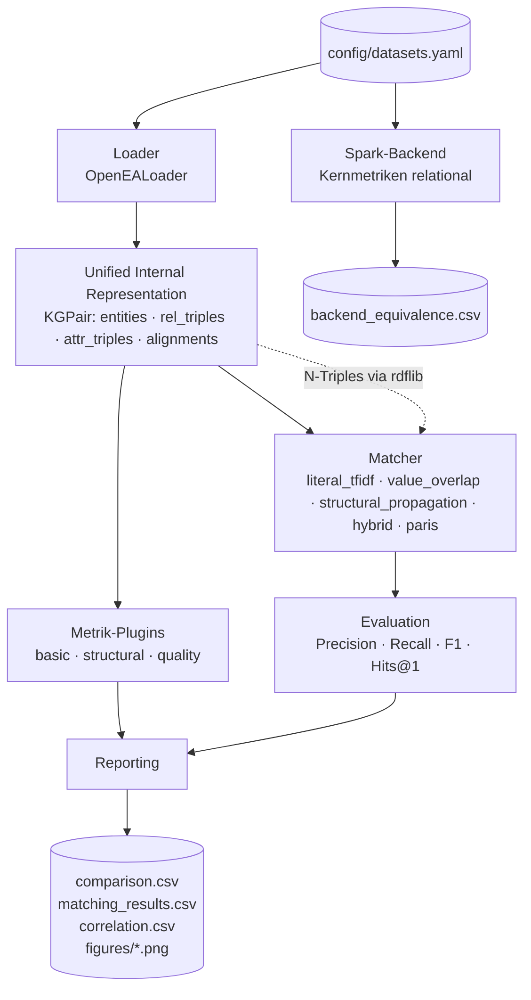

# Architektur des Quality-Evaluation-Frameworks

Stand: Implementierung für Testat 2. Dieses Dokument beschreibt den
**Ist-Zustand** des Codes, nicht mehr den Entwurf.

## 1. Designziele

| Ziel | Umsetzung |
| ---- | --------- |
| **Modularität** | Loader, Metriken und Matcher sind Plugins hinter je einem Interface; die Pipeline kennt nur die Interfaces und die Namen aus der YAML-Config |
| **Skalierbarkeit** | Kernmetriken existieren zweimal: in-memory (Pandas) und relational (PySpark); beide werden gegeneinander verifiziert |
| **Reproduzierbarkeit** | YAML-Config, feste Seeds, deterministische Outputs (JSON/CSV), Datenbeschaffung als Skript |
| **Vergleichbarkeit** | einheitliches internes Datenmodell ⇒ jede Metrik und jeder Matcher läuft unverändert auf jedem Datensatz |
| **Robustheit** | ein fehlschlagender Datensatz, eine fehlschlagende Metrik oder ein fehlschlagender Matcher bricht den Batch-Lauf nicht ab |

## 2. Pipeline



Der Lauf ist in drei abschaltbare Stufen zerlegt (`--no-profile`, `--no-match`,
`--no-report`), damit an einer Stufe gearbeitet werden kann, ohne die anderen
neu zu rechnen.

## 3. Unified Internal Representation

Alle Loader liefern dieselbe Struktur, damit Metriken und Matcher
loader-agnostisch bleiben (`src/kg_quality_eval/core.py`):

```python
@dataclass
class KGPair:
    name: str
    kg1: KnowledgeGraph
    kg2: KnowledgeGraph
    alignments: pd.DataFrame   # [e1, e2, split]  split ∈ {train, valid, test, all}
    meta: dict

@dataclass
class KnowledgeGraph:
    name: str
    entities:     pd.DataFrame  # [entity_uri]
    rel_triples:  pd.DataFrame  # [head, relation, tail]
    attr_triples: pd.DataFrame  # [head, attribute, literal, datatype]
    # cached: degrees (in/out/total), entity_index, attr_count
```

Zwei Entwurfsentscheidungen, die sich in der Implementierung als wichtig
erwiesen haben:

- **Die Entitätsmenge enthält auch Entitäten, die nur im Alignment vorkommen.**
  Sonst hätte ein Benchmark mit isolierten Gold-Entitäten künstlich bessere
  Coverage-Werte, und `share_isolated` würde systematisch unterschätzt.
- **Grad und Entity-Index sind gecacht** (`functools.cached_property`), weil
  fünf Metriken und drei Matcher sie brauchen.

## 4. Modul-Übersicht

```
src/kg_quality_eval/
├── core.py                  KGPair / KnowledgeGraph
├── runner.py                Pipeline: profile → match → report
├── loaders/
│   ├── base.py              abstract BaseLoader
│   ├── openea.py            OpenEA-Format (TSV)
│   └── rdf_export.py        N-Triples-Export via rdflib (Input für PARIS)
├── metrics/
│   ├── base.py              abstract BaseMetric, MetricResult
│   ├── basic.py             Katalog §1
│   ├── structural.py        Katalog §2  (degree, property, connectivity, long_tail)
│   ├── quality.py           Katalog §3.1–3.3, 3.6
│   └── alignment.py         Katalog §3.4–3.5
├── matching/
│   ├── base.py              BaseMatcher, SparseScoreMatcher, Sparse-Utilities
│   ├── lexical.py           literal_tfidf, value_overlap
│   ├── structural.py        structural_propagation, hybrid
│   ├── paris.py             Wrapper um das PARIS-Jar
│   └── evaluate.py          Precision / Recall / F1 / Hits@1
├── backends/
│   └── spark.py             Kernmetriken auf PySpark + Äquivalenzprüfung
├── reporting/
│   ├── comparison.py        Vergleichstabellen über Datensätze
│   ├── correlation.py       Spearman Metrik ↔ F1
│   └── plots.py             Figures
└── utils/
    ├── config.py            YAML → Dataclasses
    ├── literals.py          Literal-Parsing und -Normalisierung
    └── stats.py             Gini, Entropie, Power-Law, Histogramme
```

## 5. Schlüssel-Interfaces

```python
class BaseLoader(ABC):
    def load(self, path: Path) -> KGPair: ...

class BaseMetric(ABC):
    name: str
    category: Literal["basic", "structural", "quality"]
    def compute(self, kg_pair: KGPair) -> MetricResult: ...

@dataclass
class MetricResult:
    name: str
    scalar_values: dict[str, float]       # → JSON, geht in comparison.csv
    tabular: dict[str, pd.DataFrame]      # → CSV (Histogramme, Coverage-Tabellen)

class BaseMatcher(ABC):
    name: str
    family: str            # textual | structural | hybrid | holistic
    requires_seeds: bool
    def match(self, kg_pair: KGPair, seeds: pd.DataFrame | None) -> MatchResult: ...
```

Vier der fünf Matcher erben von `SparseScoreMatcher` und müssen nur eine
dünnbesetzte Score-Matrix $|E_1| \times |E_2|$ liefern; Top-k-Pruning,
Top-1-Auswahl und die Umwandlung in Paare erledigt die Basisklasse.

## 6. Speicher- und Laufzeitverhalten der Matcher

Der kritische Punkt ist die Ähnlichkeitsmatrix: bei 100 K × 100 K Entitäten
hat sie 10¹⁰ Einträge und ist dicht nicht darstellbar. Drei Maßnahmen halten
sie klein:

1. **Vokabular-Beschneidung.** Tokens, die in mehr als 1 % aller Entitäten
   vorkommen, werden verworfen. Sie sind die Stoppwörter dieses Korpus und
   verursachen den Großteil der Dichte im Produkt.
2. **Chunk-weises Produkt.** Die Matrix wird in Blöcken von 500 Zeilen
   berechnet.
3. **Sofortiges Top-k-Pruning.** Jeder Block wird direkt auf die zehn besten
   Kandidaten pro Zeile reduziert, bevor der nächste gerechnet wird.

Dadurch bleibt der Speicherbedarf linear in $|E_1|$ statt quadratisch — der
100 K-Datensatz läuft mit denselben Parametern durch wie die 15 K-Datensätze.

## 7. Zwei Backends: Pandas und PySpark

Die Kernmetriken (Basis-Statistiken, Degree-Verteilung, Property-Verteilung)
sind zweimal implementiert:

| | Pandas | PySpark |
| --- | --- | --- |
| Datenhaltung | vollständig im Hauptspeicher | partitioniert, spillt auf Platte |
| Grad-Berechnung | `value_counts` + `map` | zwei `groupBy` + Left Join |
| Gini | sortiertes NumPy-Array | `row_number()`-Window über sortierte Werte |
| Quantile | `np.percentile` | `approxQuantile(relativeError=0)` |

`scripts/run_backend_benchmark.py` rechnet beide Wege und vergleicht sie
metrikweise. Ergebnis auf `EN_FR_15K_V1`: **29 von 29 vergleichbaren Metriken
identisch**. Die Spark-Variante ist auf dieser Datengröße wegen JVM- und
Shuffle-Overhead deutlich langsamer — der Nutzen liegt darin, dass ihre
Laufzeit nicht am Hauptspeicher hängt.

Nicht auf Spark portiert sind Connectivity (bräuchte GraphFrames) und die
Stichproben-Metriken; beide sind im Katalog als Pandas/NetworkX-Pfad
ausgewiesen.

## 8. Konfiguration

```yaml
project: kg-quality-eval
output_dir: results/reports
eval_split: test          # worauf bewertet wird
seed_split: train         # was die semi-supervised Matcher sehen dürfen

datasets:
  - name: EN_FR_15K_V1
    loader: openea
    path: data/raw/openea/EN_FR_15K_V1
    fold: 1
    skip_matchers: []     # optional, z. B. [paris] auf schwacher Hardware

metrics: [basic_stats, degree_distribution, ...]

matchers:
  - name: literal_tfidf
  - name: paris
    params: {jar_path: tools/paris_0_3.jar, heap: 4g}

backend:
  mode: pandas
  spark_master: local[*]
  spark_memory: 4g
```

## 9. Erweiterungs-Hooks

| Hook | Aufwand |
| ---- | ------- |
| Neuer Datensatz im OpenEA-Format | ein Eintrag in der YAML-Config |
| Neues Datenformat | `BaseLoader`-Subklasse + Registry-Eintrag in `loaders/__init__.py` |
| Neue Metrik | `BaseMetric`-Subklasse + Registry-Eintrag in `metrics/__init__.py` |
| Neuer Matcher | `SparseScoreMatcher`-Subklasse (nur `score_matrix`) + Registry-Eintrag |
| Neues Backend | Modul in `backends/` mit derselben Skalar-Schlüsselmenge |

## 10. Gelöste Umsetzungsprobleme

| Problem | Lösung |
| ------- | ------ |
| PARIS kürzt URIs mit eigenen Präfixen (`dbp:resource/X`), Rückabbildung schlägt fehl | Export **aller** Terme in einen synthetischen Namespace, den PARIS nicht kennt — Round-Trip ist damit exakt und wird in `tests/test_loaders.py` geprüft |
| PARIS schreibt eine leere letzte Iterationsdatei (Klassen-Phase) | es wird die höchstnummerierte **nicht-leere** `*_eqv.tsv` gelesen |
| OpenEA-Literale enthalten unbalancierte Anführungszeichen | Spark liest die Dateien als Text und splittet explizit am Tab; Pandas liest mit `quoting=QUOTE_NONE` |
| YAGO-Terme sind keine gültigen IRIs (`YAGO/E473489`, `isLocatedIn`) | reversible Abbildung in den synthetischen Namespace |
| Uneinheitliche Datentyp-Notation (`^^<...>` vs. `^^xsd:date`) | ein zentraler Literal-Parser in `utils/literals.py`, mit Parametrisierten Tests |
| Ähnlichkeitsmatrix bei 100 K Entitäten | siehe §6 |
