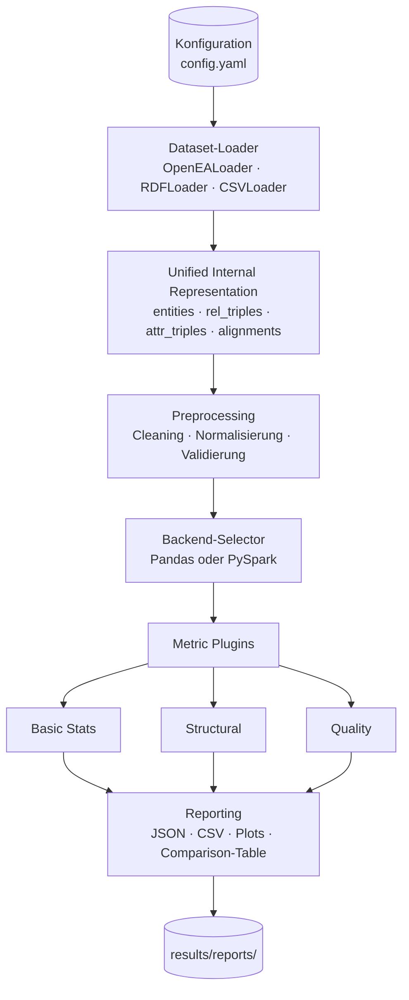
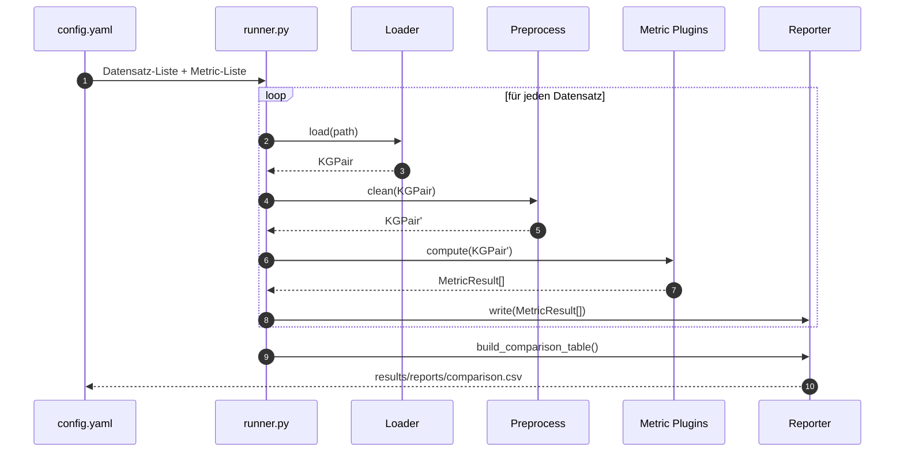

# Architektur des Quality-Evaluation-Frameworks

## 1. Designziele

| Ziel                       | Konkret                                                                                            |
| -------------------------- | -------------------------------------------------------------------------------------------------- |
| **Modularität**            | Loader, Metriken, Reporting unabhängig austauschbar (Plugin-Architektur)                          |
| **Skalierbarkeit**         | identische Metrik-Logik auf Pandas (klein) und PySpark (groß) — selber Code, anderes Backend       |
| **Reproduzierbarkeit**     | Konfiguration via YAML, deterministische Outputs (JSON/CSV), Seeds dokumentiert                    |
| **Vergleichbarkeit**       | Einheitliches internes Datenmodell ⇒ direkter Vergleich der 7 Datensätze                          |
| **Erweiterbarkeit**        | neue Metriken/Loader via Subclassing eines Interfaces — kein Eingriff in Pipeline-Core             |

---

## 2. High-Level-Pipeline



---

## 3. Unified Internal Representation

Alle Loader liefern dieselbe interne Datenstruktur, damit Metriken loader-agnostisch implementiert werden können:

```python
@dataclass
class KGPair:
    name: str
    kg1: KnowledgeGraph
    kg2: KnowledgeGraph
    alignments: pd.DataFrame  # columns: [e1, e2, split]   split ∈ {train, valid, test}

@dataclass
class KnowledgeGraph:
    name: str
    entities:     pd.DataFrame  # [entity_uri]
    rel_triples:  pd.DataFrame  # [head, relation, tail]
    attr_triples: pd.DataFrame  # [head, attribute, literal, datatype]
```

Auf der PySpark-Seite sind dieselben Schemata als Spark `DataFrame` realisiert ⇒ Metriken sehen dieselbe Schnittstelle.

---

## 4. Modul-Übersicht

```
src/kg_quality_eval/
├── __init__.py
├── core.py                 ← KGPair / KnowledgeGraph (s.o.)
├── loaders/
│   ├── base.py             ← abstract BaseLoader
│   ├── openea.py           ← OpenEA-Format
│   ├── rdf.py              ← RDF/OWL via rdflib
│   └── csv.py              ← einfaches CSV
├── preprocessing/
│   ├── cleaning.py         ← URI-Normalisierung, Encoding
│   └── validation.py       ← Schema-Checks
├── metrics/
│   ├── base.py             ← abstract BaseMetric
│   ├── basic.py            ← Section 1 des Katalogs
│   ├── structural.py       ← Section 2
│   └── quality.py          ← Section 3
├── reporting/
│   ├── exporters.py        ← JSON/CSV/Plot-Export
│   └── comparison.py       ← Sammel-Tabelle über alle Datensätze
├── backend/
│   ├── pandas_backend.py
│   └── spark_backend.py
└── utils/
    ├── config.py           ← YAML-Loader, dataclass-basiert
    └── logging.py
```

---

## 5. Schlüssel-Interfaces

### 5.1 Loader

```python
class BaseLoader(ABC):
    @abstractmethod
    def load(self, path: Path) -> KGPair: ...

    @property
    @abstractmethod
    def supported_formats(self) -> list[str]: ...
```

### 5.2 Metric

```python
class BaseMetric(ABC):
    name: str
    category: Literal["basic", "structural", "quality"]

    @abstractmethod
    def compute(self, kg_pair: KGPair, backend: Backend) -> MetricResult: ...

@dataclass
class MetricResult:
    name: str
    scalar_values: dict[str, float]    # einzelne Kennzahlen
    tabular: pd.DataFrame | None        # tabellarische Outputs (Histogramme)
    plot_spec: PlotSpec | None          # optionale Plot-Anweisung
```

### 5.3 Backend

```python
class Backend(Protocol):
    def groupby_count(self, df, by: list[str]) -> "Frame": ...
    def join(self, left, right, on) -> "Frame": ...
    # … einheitliche Schnittstelle für Pandas & Spark
```

---

## 6. Backend-Selection-Strategie

Heuristik in `pipeline.py`:

```python
def pick_backend(n_triples: int, force: str | None = None) -> Backend:
    if force:
        return load_backend(force)
    return SparkBackend() if n_triples > 1_000_000 else PandasBackend()
```

**Gründe:**

- **Pandas** ist für < 1 M Tripel deutlich schneller (kein JVM-Overhead) und einfacher zu debuggen.
- **PySpark** wird für die 100K-Variante genutzt — demonstriert Big-Data-Aspekt.
- Die Backend-Schnittstelle (`groupby_count`, `join`, `histogram`) abstrahiert Frame-Operationen — Metric-Code bleibt identisch.

---

## 7. Datenfluss (sequenziell)



---

## 8. Konfigurationsschema (Beispiel)

`config/datasets.yaml`:

```yaml
project: kg-quality-eval
output_dir: results/reports

datasets:
  - name: openea_en_fr_15k_v1
    loader: openea
    path: data/raw/openea/EN_FR_15K_V1
  - name: openea_en_fr_15k_v2
    loader: openea
    path: data/raw/openea/EN_FR_15K_V2
  # … 5 weitere

metrics:
  - basic_stats
  - degree_distribution
  - property_distribution
  - connectivity
  - attribute_completeness
  - type_distribution
  - alignment_metrics

backend:
  mode: auto         # auto | pandas | spark
  spark_master: local[*]
  spark_memory: 4g
```

---

## 9. Skalierbarkeit & Performance

| Datensatzgröße      | Backend  | Geschätzte Laufzeit pro Datensatz |
| ------------------- | -------- | --------------------------------- |
| < 50 K Tripel       | Pandas   | ≤ 10 s                            |
| 50 K – 1 M Tripel   | Pandas   | 10 s – 2 min                      |
| > 1 M Tripel        | PySpark  | 2 – 10 min (Single-Node, 4 Cores) |

Power-Law-Fit und Connectivity (Sect. 2.3) sind die teuersten Operationen — Connectivity nutzt für > 100 K Tripel ein **Sampling** (Subset-Approximation).

---

## 10. Erweiterungs-Hooks

| Hook                                | Was muss man tun?                                              |
| ----------------------------------- | -------------------------------------------------------------- |
| Neuer Datensatz im OpenEA-Format    | nur `config/datasets.yaml`-Eintrag                             |
| Neues Datenformat (z.B. JSON-LD)    | neue `BaseLoader`-Subklasse in `loaders/`                      |
| Neue Metrik                         | neue `BaseMetric`-Subklasse in `metrics/` + Eintrag in Config  |
| Neues Backend (z.B. Dask)           | neue `Backend`-Implementierung — Metriken bleiben unverändert  |

---

## 11. Risiken & Gegenmaßnahmen

| Risiko                                              | Gegenmaßnahme                                                  |
| --------------------------------------------------- | -------------------------------------------------------------- |
| OpenEA-Download (1.1 GB) zu groß für Repo           | nicht ins Repo; Setup-Skript lädt nach `data/raw/`             |
| PySpark-Setup macht auf macOS Probleme              | Docker-Image als Fallback dokumentieren                        |
| Power-Law-Fit instabil bei kleinen KGs              | nur ab N ≥ 1000 Entitäten anwenden                             |
| OAEI im OWL-Format ⇒ rdflib-Parsing kann scheitern  | Fallback: vorab via Tool (Protégé) zu N-Triples konvertieren    |
